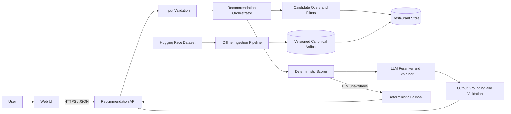
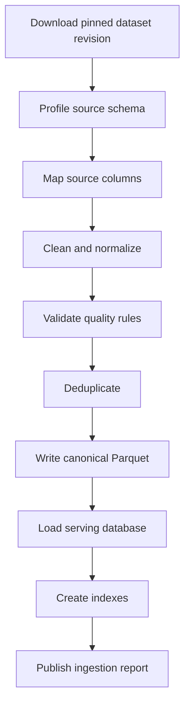
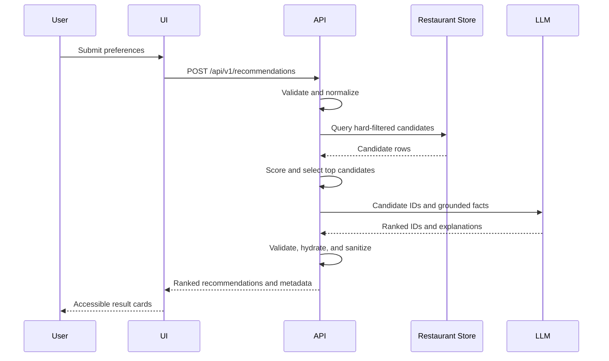

# AI-Powered Restaurant Recommendation System — Architecture

## 1. Purpose

This document defines an implementation-ready architecture for the restaurant recommendation system described in [problemStatement.md](problemStatement.md). The system accepts a user's location, budget, cuisine, minimum rating, and optional preferences; finds suitable restaurants in the Zomato dataset; and uses a Large Language Model (LLM) to rank and explain the best matches.

The core architectural rule is:

> Structured code selects valid candidates; the LLM may rerank and explain only those candidates.

This prevents the LLM from inventing restaurants, prices, ratings, or features that are not supported by the dataset.

## 2. Goals and Non-Goals

### Goals

- Load and normalize the Hugging Face Zomato dataset.
- Support deterministic filtering by location, budget, cuisine, and minimum rating.
- Interpret optional natural-language preferences safely.
- Produce a ranked list of relevant restaurants.
- Generate concise, human-readable explanations grounded in restaurant data.
- Return useful results when the LLM is unavailable.
- Keep the initial implementation simple enough for local development while providing a production upgrade path.
- Make recommendation behavior observable, testable, and reproducible.

### Non-Goals for the MVP

- Restaurant booking, ordering, payment, or delivery tracking.
- Real-time menus, prices, availability, or opening hours.
- Collaborative filtering based on user histories.
- Sponsored placement or advertising.
- Claiming that a restaurant has a feature such as "family-friendly" unless the source data supports it.
- Allowing the LLM to search the complete dataset directly.

## 3. Validated Assumptions and Constraints

- The pinned Hugging Face dataset is the initial source of truth. Phase 0 findings and the exact source mapping are recorded in [docs/data-profile.md](docs/data-profile.md).
- The source contains 51,717 Bengaluru restaurant-listing rows and 17 columns in the `default/train` split. The MVP therefore supports Bengaluru localities only; it is not a Delhi or multi-city catalogue.
- The source cost column is explicitly estimated cost for two people. For this Bengaluru dataset, the canonical mapping records INR and `for_two`.
- Ratings are textual values on a 5-point scale. Null, `NEW`, and `-` values normalize to unknown.
- Ratings, costs, cuisines, and locations contain missing or textual values, and listing-context duplicates are present.
- Budget thresholds are configuration, not universal facts. The accepted MVP defaults are low up to ₹600, medium above ₹600 through ₹1,500, and high above ₹1,500.
- Optional preferences are soft preferences only when supported by source fields or explicitly verified tags. Family-friendly, quick-service, ambience, allergen, and live-availability claims are unsupported in the MVP.
- The first version is a single-region, read-heavy application without user accounts.
- The source repository does not publish license metadata or a dataset card. Production distribution/use is blocked until licensing is clarified.

## 4. Architecture Style

Use a **modular monolith** for the MVP. The API, recommendation logic, LLM integration, and data-access modules live in one backend deployment but have explicit boundaries. Data ingestion runs as a separate command or scheduled job.

This is preferable to microservices at the current scale because it minimizes deployment and debugging overhead while keeping modules separable if usage grows.



## 5. Recommended Technology Stack

| Layer | Recommended technology | Reason |
|---|---|---|
| Web client | React, TypeScript, Vite | Fast local development, typed API integration, accessible component ecosystem |
| API | Python 3.12, FastAPI, Pydantic | Strong fit for data and LLM workloads; automatic validation and OpenAPI documentation |
| Data ingestion | Hugging Face `datasets`, Polars or pandas | Direct dataset access and robust tabular transformations |
| Local data | SQLite plus a canonical Parquet snapshot | Zero-configuration local setup and reproducible source artifacts |
| Production data | PostgreSQL | Indexed filtering, concurrent reads, operational maturity |
| LLM integration | Provider-neutral adapter | Avoids coupling core logic to one model vendor |
| Optional cache | Redis | Useful only after repeated-query traffic justifies it |
| Testing | Pytest, Vitest, Playwright | Unit, integration, and browser coverage |
| Packaging/deployment | Docker and Docker Compose | Consistent development and deployment environments |

SQLite and PostgreSQL should be accessed through the same repository interface. PostgreSQL is not required for the first local prototype.

## 6. Major Components

### 6.1 Web Client

Responsibilities:

- Collect structured preferences.
- Validate obvious issues before submission.
- Submit recommendation requests.
- Render ranked result cards and explanations.
- Clearly distinguish hard filters from optional preferences.
- Display empty, partial, fallback, and error states.
- Preserve submitted filters so users can refine a search.

Recommended input controls:

- Searchable location selector populated from available normalized locations.
- Budget selector with low, medium, high, and optional custom maximum.
- Multi-select cuisine control.
- Minimum-rating slider or selector.
- Free-text optional preferences with examples.
- Result-count selector capped by the API.

Each result card should show the restaurant name, location, cuisines, rating, estimated cost, fit explanation, and any data limitations. It must not imply that inferred or missing information is verified.

### 6.2 Recommendation API

Responsibilities:

- Validate and normalize requests.
- Resolve budget labels to configured numeric ranges.
- Invoke the recommendation orchestrator.
- Return a stable, versioned response contract.
- Apply rate limits, request timeouts, and request-size limits.
- Expose health and metadata endpoints.

The API must not expose model credentials or raw internal prompts.

### 6.3 Recommendation Orchestrator

The orchestrator executes the use case in a fixed sequence:

1. Normalize user input.
2. Apply hard filters to the restaurant store.
3. Relax only permitted filters if no candidates are found.
4. Calculate deterministic feature scores.
5. Select a bounded candidate set.
6. Ask the LLM to rerank and explain those candidates.
7. Validate the LLM response against the candidate set and schema.
8. Return validated LLM results or the deterministic fallback.

The orchestrator owns policy. The LLM provider adapter only handles model communication.

### 6.4 Restaurant Repository

Provides storage-independent methods such as:

- `list_locations(query)`
- `list_cuisines(location)`
- `find_candidates(filters, limit)`
- `get_by_ids(ids)`
- `get_dataset_version()`

It must use parameterized queries and normalized indexed columns. It should never load the entire production dataset for an individual request.

### 6.5 Deterministic Filter and Scorer

Hard constraints are applied before any LLM call:

- Normalized location match.
- Minimum rating.
- Maximum budget or selected budget band.
- At least one requested cuisine, unless the user explicitly requests all cuisines.

Suggested deterministic score on a 0–1 scale:

```text
base_score =
    0.35 * rating_score
  + 0.30 * cuisine_match_score
  + 0.20 * budget_fit_score
  + 0.15 * preference_evidence_score
```

- `rating_score`: normalized valid rating.
- `cuisine_match_score`: proportion of requested cuisines matched.
- `budget_fit_score`: rewards options comfortably within budget rather than merely below the maximum.
- `preference_evidence_score`: matches optional preferences only to verified fields or derived tags.

Weights belong in configuration and should be covered by ranking tests. Location is a filter, not a score, unless nearby-area search is added later.

To control token usage, send only the top 10–20 deterministic candidates to the LLM and return no more than 5–10 results.

### 6.6 Optional-Preference Interpreter

Free-text preferences such as "quiet place for a family dinner" need controlled interpretation.

The interpreter should convert text to a small allow-listed structure:

```json
{
  "desired_tags": ["family_friendly", "quiet"],
  "excluded_tags": [],
  "occasion": "family dinner"
}
```

Rules:

- Reject fields outside the allow-list.
- Treat these values as soft preferences.
- Score a tag only if the source contains supporting evidence.
- If evidence is absent, say that the preference could not be verified.
- Do not convert subjective phrases into factual claims without data.

For the simplest MVP, skip a separate model call and pass the sanitized free text to the final LLM prompt as a preference, explicitly instructing the model not to claim unsupported matches.

### 6.7 LLM Gateway

The gateway abstracts provider-specific details behind an interface:

```python
class RecommendationModel:
    async def rank_and_explain(
        self,
        request: RecommendationContext,
        candidates: list[Candidate],
    ) -> RankedRecommendationSet: ...
```

Responsibilities:

- Apply a strict system prompt.
- Request schema-constrained JSON output where supported.
- Enforce timeout, retry, and token limits.
- Record latency, model name, and token counts without logging sensitive prompt content.
- Map provider errors to internal error types.
- Support a fake implementation for tests.

The model should receive compact JSON, not raw dataset rows or SQL results.

### 6.8 Output Grounding and Validator

Every model response must be treated as untrusted input. The validator must ensure:

- Every returned `restaurant_id` was in the supplied candidate list.
- IDs are unique and the result count is within the requested limit.
- Rating, cost, cuisine, and restaurant name come from backend data, not model output.
- Explanation length is bounded.
- Explanations do not contain unsupported numeric or feature claims.
- Output conforms to the response schema.

After validation, the backend hydrates display fields from the database. If validation fails, it retries once with a repair instruction or returns deterministic results.

Phase 5 implementation policy: [ADR-005](docs/adr/ADR-005-grounded-groq-ranking.md) constrains
model explanations to selecting and ordering approved evidence sentences. The retry/repair
budget is shared (at most two provider calls total), and hydration is bound to the request's
dataset version. An optional summary is accepted only from the approved summary set. This
enforces grounding without treating free-form prose or a second model's opinion as proof.

## 7. Data Ingestion Architecture

Ingestion is an offline, repeatable pipeline rather than part of request handling.



### 7.1 Pipeline Stages

1. **Download:** Fetch the dataset using a pinned revision when possible.
2. **Profile:** Record columns, types, row count, null rates, and representative values.
3. **Map:** Map source columns to the canonical schema using explicit configuration.
4. **Normalize:** Clean strings, split cuisines, parse costs and ratings, and create stable IDs.
5. **Validate:** Quarantine invalid rows and enforce quality thresholds.
6. **Deduplicate:** Resolve duplicate restaurant/location records deterministically.
7. **Snapshot:** Write a versioned Parquet artifact and manifest.
8. **Load:** Replace or upsert data into the serving database in a transaction.
9. **Index:** Build indexes after bulk loading.
10. **Report:** Store row counts, rejected rows, hashes, source revision, and timestamps.

### 7.2 Normalization Rules

- Trim and collapse whitespace.
- Preserve original display text alongside normalized search values.
- Case-fold location and cuisine fields for matching.
- Remove currency symbols and thousands separators before parsing costs.
- Convert invalid or placeholder ratings such as `NEW`, `-`, or empty values to null.
- Store cuisine names as a normalized many-to-many relationship or normalized array.
- Generate a stable restaurant ID from a source ID when available; otherwise use a hash of stable identity fields.
- Never silently replace missing rating or cost with zero.

### 7.3 Data Quality Gates

An ingestion run should fail before publication when:

- Required mapped columns are absent.
- No valid rows remain.
- Duplicate stable IDs remain after deduplication.
- Parsed cost or rating validity drops below configured thresholds.
- Ratings fall outside the accepted scale after normalization.

Rows with recoverable issues may be quarantined with reason codes. The previous successful dataset remains active if a new ingestion run fails.

## 8. Canonical Data Model

### 8.1 Restaurant

| Field | Type | Notes |
|---|---|---|
| `id` | string/UUID | Stable internal identifier |
| `source_id` | string | Normalized Zomato URL host/path; fall back to a documented identity hash when unavailable |
| `name` | string | Required display name |
| `location_display` | string | Human-readable location |
| `location_normalized` | string | Indexed matching value |
| `city` | string | `Bengaluru` for the pinned source after whole-dataset validation |
| `address` | string, nullable | Display only unless location search is added |
| `cuisines` | string array/relation | Cleaned cuisine labels |
| `cost_amount` | decimal, nullable | Normalized estimated cost |
| `currency` | string | `INR` for known costs in this source mapping |
| `cost_basis` | enum | `for_two` for known costs in this source mapping |
| `rating` | decimal, nullable | Normalized rating |
| `rating_scale` | decimal | `5` for known ratings in this source mapping |
| `votes` | integer, nullable | Useful confidence signal if available |
| `verified_tags` | string array | Only source-backed or documented derived tags |
| `source_url` | string, nullable | Link when available |
| `dataset_version` | string | Lineage and cache invalidation |
| `ingested_at` | timestamp | UTC ingestion time |

Recommended indexes:

- `(location_normalized, rating)`
- `(location_normalized, cost_amount)`
- Cuisine lookup index or join-table indexes.
- Optional trigram/full-text index for location autocomplete in PostgreSQL.

### 8.2 Dataset Manifest

Store the source repository, revision, download time, content hash, raw and accepted row counts, rejection summary, mapping version, and pipeline version. Include `dataset_version` in recommendation responses for traceability.

## 9. API Design

All endpoints are versioned under `/api/v1`.

### 9.1 Create Recommendations

`POST /api/v1/recommendations`

Request:

```json
{
  "location": "Bangalore",
  "budget": {
    "band": "medium",
    "max_amount": null,
    "currency": "INR"
  },
  "cuisines": ["Italian", "Chinese"],
  "minimum_rating": 4.0,
  "additional_preferences": "Family-friendly and suitable for a relaxed dinner",
  "limit": 5
}
```

Response:

```json
{
  "request_id": "rec_01H...",
  "recommendations": [
    {
      "restaurant_id": "rst_123",
      "name": "Example Restaurant",
      "location": "Indiranagar, Bangalore",
      "cuisines": ["Italian"],
      "rating": 4.3,
      "estimated_cost": {
        "amount": 1200,
        "currency": "INR",
        "basis": "for_two"
      },
      "explanation": "Matches your Italian preference, exceeds your minimum rating, and fits the selected budget.",
      "matched_preferences": ["Italian", "minimum rating", "budget"],
      "unverified_preferences": ["family-friendly"]
    }
  ],
  "meta": {
    "dataset_version": "2026-09-13.sha256-abcd",
    "ranking_mode": "llm_assisted",
    "filters_relaxed": [],
    "candidate_count": 14
  }
}
```

The backend, not the LLM, populates factual display fields.

### 9.2 Supporting Endpoints

- `GET /api/v1/metadata/locations?query=bang` — location autocomplete.
- `GET /api/v1/metadata/cuisines?location=Bangalore` — available cuisines.
- `GET /api/v1/metadata/budget-bands` — configured labels and thresholds.
- `GET /health/live` — process liveness.
- `GET /health/ready` — database readiness and active dataset availability.

### 9.3 Error Contract

```json
{
  "error": {
    "code": "NO_MATCHES",
    "message": "No restaurants matched all selected filters.",
    "request_id": "rec_01H...",
    "details": {
      "suggestions": ["Lower the minimum rating", "Try a nearby location"]
    }
  }
}
```

Use stable codes such as `VALIDATION_ERROR`, `NO_MATCHES`, `DATASET_UNAVAILABLE`, `RATE_LIMITED`, and `INTERNAL_ERROR`. Do not return provider errors or stack traces to clients.

## 10. Recommendation Request Flow



If the LLM times out or returns invalid output, the API returns deterministic rankings with `ranking_mode: "deterministic_fallback"`. Users still receive results rather than a generic failure.

## 11. Prompt and Output Contract

The model prompt should contain:

1. **Role:** Rank only the supplied restaurant candidates.
2. **User preferences:** Normalized filters and sanitized optional text.
3. **Candidate facts:** IDs and only necessary structured fields.
4. **Rules:** Never create restaurants or facts; acknowledge unsupported preferences; do not alter numeric values.
5. **Output schema:** Ranked candidate IDs, short explanations, matched preference keys, and unverified preference keys.

Conceptual output:

```json
{
  "ranked": [
    {
      "restaurant_id": "rst_123",
      "explanation": "A strong cuisine, rating, and budget match.",
      "matched_preferences": ["cuisine", "rating", "budget"],
      "unverified_preferences": ["family_friendly"]
    }
  ],
  "summary": "These options best balance the requested cuisines, rating, and budget."
}
```

Do not ask the model to repeat name, rating, or price; this reduces hallucination risk and tokens. Explanations should be limited to roughly 40–60 words per result.

## 12. Empty Results and Filter Relaxation

No hard filter should be silently relaxed. Recommended behavior:

1. Return exact matches when available.
2. When none exist, calculate possible relaxation suggestions without applying them.
3. Ask the user to approve a broader search, or expose clearly labelled alternative results.

Potential relaxations, in order:

1. Include additional cuisines.
2. Lower minimum rating by a small configured step.
3. Expand budget by a configured percentage.
4. Search nearby areas only if a reliable geographic mapping exists.

The response must list any applied relaxation in `meta.filters_relaxed`.

## 13. Configuration and Secrets

Configuration should be environment-driven and validated at startup:

- Database URL.
- LLM provider, model, endpoint, and API key reference.
- LLM timeout, retry count, and candidate cap.
- Budget thresholds and default currency.
- Maximum recommendation count.
- Dataset repository and pinned revision.
- Allowed web origins.
- Logging level and environment name.

Keep secrets in environment variables or a deployment secret manager. Commit an `.env.example` containing names and safe examples, never real keys.

## 14. Security and Privacy

- Validate all request fields with strict length, type, range, and enum constraints.
- Treat optional-preference text as untrusted data, not model instructions.
- Delimit user text and candidate data in prompts to reduce prompt injection risk.
- Use parameterized database queries.
- Rate-limit recommendation requests because they incur model cost.
- Allow CORS only for known origins in production.
- Avoid collecting personal data in the MVP.
- Do not log full free-text input by default; use redaction or hashes for diagnostics.
- Keep detailed internal errors server-side.
- Scan dependencies and pin production versions.
- Add authentication only when user-specific history or administrative ingestion endpoints are introduced.

## 15. Reliability and Performance

### Targets for the MVP

- Metadata endpoints: p95 under 300 ms locally or in-region.
- Deterministic recommendations: p95 under 1 second.
- LLM-assisted recommendations: p95 under 8 seconds, dependent on provider.
- Successful deterministic fallback whenever the database is healthy.

### Controls

- Database query limit and indexes.
- Candidate cap before prompt construction.
- End-to-end and provider timeouts.
- At most one model retry for transient or schema errors.
- Circuit breaker after repeated provider failures.
- Cache metadata endpoints by dataset version.
- Cache identical recommendation requests only if privacy and staleness rules allow it.
- Graceful shutdown and database connection pooling.

## 16. Observability

Use structured logs with a request/correlation ID. Capture:

- Request outcome and normalized filter categories, excluding sensitive free text.
- Candidate count before and after filters.
- Recommendation mode: LLM-assisted or fallback.
- LLM latency, token usage, model, retries, and validation failures.
- Database query duration.
- Ingestion row counts and rejection reasons.
- Dataset and prompt versions.

Recommended metrics:

- API latency and error rate by endpoint.
- Empty-result rate.
- LLM fallback rate.
- Invalid model-output rate.
- Average candidates per request.
- Estimated model cost per recommendation.
- Ingestion freshness and rejected-row percentage.

Never use restaurant names, user text, or raw prompts as metric labels.

## 17. Testing Strategy

### Unit Tests

- Cost and rating parsing.
- Location and cuisine normalization.
- Budget-band boundaries.
- Hard-filter behavior.
- Scoring and tie-breaking.
- Stable ID generation and deduplication.
- Model-output validation and rejection of unknown IDs.
- Prompt-injection handling in optional preferences.

### Data Contract Tests

- Required source-to-canonical mappings exist.
- Canonical schema types remain stable.
- Ratings and costs satisfy accepted ranges.
- Stable IDs are unique.
- A pinned dataset sample produces a known normalization result.

### Integration Tests

- API with a temporary database and fake LLM.
- Valid, empty, malformed, timeout, and invalid-model-output scenarios.
- Deterministic fallback when the provider is unavailable.
- Database migration and ingestion rollback behavior.

### End-to-End Tests

- Submit a complete preference form and render recommendations.
- Change filters and receive updated results.
- Handle no matches with actionable suggestions.
- Render fallback results visibly but without alarming the user.
- Keyboard navigation, labels, focus handling, and screen-reader status updates.
- Responsive behavior on mobile and desktop.

### Evaluation Set

Maintain a versioned set of representative queries with expected constraints and relevance judgments. At minimum, evaluate:

- Location correctness.
- Cuisine match.
- Budget compliance.
- Rating compliance.
- Unsupported-claim rate.
- Ranking usefulness judged against a deterministic baseline.

A release must have zero unknown restaurant IDs and zero hard-filter violations in the evaluation set.

## 18. Deployment Architecture

### Local Development

Docker Compose can run:

- `web` — React development server or static production build.
- `api` — FastAPI application.
- `db` — optional PostgreSQL; SQLite may be used for the lightest setup.
- `ingest` — one-shot profile/normalize/load command.

### Production

- Serve the static web build through a CDN or web server.
- Run one or more stateless API containers behind HTTPS.
- Use managed PostgreSQL with backups.
- Run ingestion as a scheduled job or controlled release job.
- Store canonical data artifacts in versioned object storage.
- Store secrets in the platform's secret manager.

Deploy database migrations before the application version that needs them. Publish a new dataset transactionally and retain the previous version for rollback.

## 19. Suggested Repository Structure

```text
.
├── architecture.md
├── problemStatement.md
├── README.md
├── .env.example
├── apps/
│   ├── api/
│   │   ├── app/
│   │   │   ├── api/                 # Routes and API schemas
│   │   │   ├── core/                # Config, logging, errors
│   │   │   ├── domain/              # Entities and policies
│   │   │   ├── recommendations/     # Orchestrator, filters, scoring
│   │   │   ├── llm/                 # Provider interface and adapters
│   │   │   ├── repositories/        # Data-access interfaces
│   │   │   └── main.py
│   │   └── tests/
│   └── web/
│       ├── src/
│       │   ├── api/
│       │   ├── components/
│       │   ├── features/recommendations/
│       │   └── pages/
│       └── tests/
├── data/
│   ├── README.md
│   ├── manifests/                   # Commit small lineage manifests
│   └── samples/                     # Small non-sensitive test fixtures
├── pipelines/
│   ├── ingest.py
│   ├── mappings/
│   └── tests/
├── migrations/
├── evals/
│   ├── cases.jsonl
│   └── README.md
├── docker-compose.yml
└── pyproject.toml
```

Large raw datasets, generated databases, secrets, and model responses should be excluded from version control.

## 20. Delivery Phases

### Phase 1 — Data Foundation

- Profile the actual Hugging Face schema.
- Define and test column mappings.
- Build normalization, validation, deduplication, and snapshot generation.
- Load SQLite and expose dataset metadata.

Exit criterion: repeatable ingestion produces a quality report and queryable canonical records.

### Phase 2 — Deterministic Recommendation MVP

- Implement the API, repository, filters, scoring, and error contracts.
- Build the preference form and result cards.
- Add unit, integration, and end-to-end tests.

Exit criterion: users receive correct ranked results without any LLM dependency.

### Phase 3 — Grounded LLM Enhancement

- Add the provider-neutral LLM gateway.
- Define schema-constrained prompting and output validation.
- Add timeout, retry, circuit breaker, and deterministic fallback.
- Build the evaluation set and measure improvement over the baseline.

Exit criterion: explanations are grounded, all hard constraints remain satisfied, and provider failure does not break recommendations.

### Phase 4 — Production Hardening

- Move to PostgreSQL if required by scale.
- Add rate limiting, dashboards, alerting, deployment automation, and backups.
- Establish controlled dataset refresh and rollback.
- Perform accessibility, security, performance, and cost reviews.

## 21. Key Architecture Decisions

| Decision | Rationale |
|---|---|
| Deterministic filtering before the LLM | Guarantees hard constraints and reduces hallucinations and cost |
| LLM receives a bounded candidate set | Keeps latency and tokens predictable |
| Backend hydrates all factual fields | Prevents model-generated price, rating, or restaurant facts |
| Modular monolith for MVP | Minimizes operational complexity without sacrificing module boundaries |
| Offline, versioned ingestion | Makes request handling fast and dataset changes auditable |
| Provider-neutral LLM interface | Enables model changes and reliable fakes in tests |
| Deterministic fallback | Preserves core functionality during model failures |
| Explicit unsupported-preference reporting | Avoids presenting assumptions as verified restaurant attributes |

## 22. Risks and Mitigations

| Risk | Mitigation |
|---|---|
| Dataset schema or quality differs from assumptions | Profile first, use explicit mappings, and fail quality gates before publication |
| Stale restaurant information | Display dataset version/freshness and avoid real-time claims |
| LLM hallucinates facts or candidates | Restrict candidate IDs, validate output, and hydrate facts from storage |
| Model latency or outage | Bound timeouts and use deterministic fallback |
| High model cost | Pre-rank candidates, cap tokens/results, monitor costs, and cache cautiously |
| Subjective preferences lack evidence | Mark them unverified and never claim a match without supporting data |
| Few or no exact results | Suggest transparent relaxations and never silently weaken constraints |
| Bias toward highly rated popular venues | Monitor ranking distribution and use vote count only as a confidence signal, not an unchecked popularity boost |

## 23. Definition of Done for the MVP

The MVP is complete when:

- The pinned dataset can be ingested reproducibly with a quality report.
- Users can submit all inputs from the problem statement.
- Every returned restaurant satisfies the displayed hard constraints.
- Each result displays name, cuisine, rating, estimated cost, and a grounded explanation.
- Missing or unsupported data is labelled instead of invented.
- The application returns deterministic results when the LLM is disabled or unavailable.
- API contracts and core ranking logic have automated tests.
- A browser test covers the primary user journey and empty-results state.
- Secrets are not committed, logs avoid raw user text, and health endpoints support deployment checks.
- The response includes the dataset version and ranking mode for traceability.
