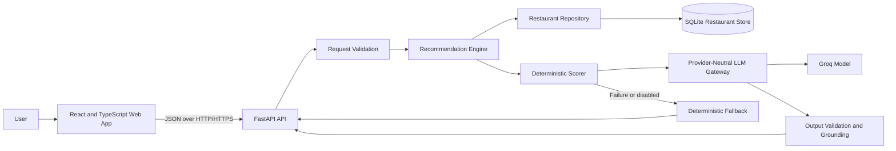
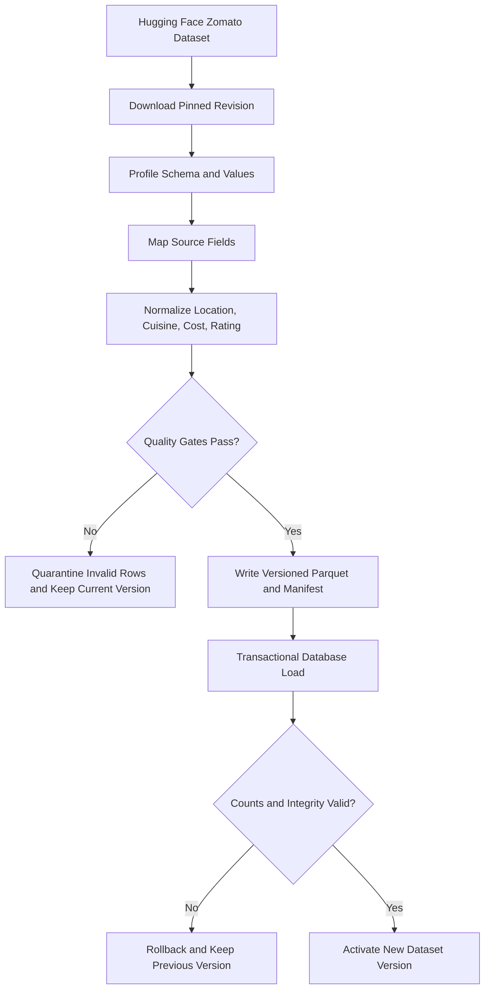
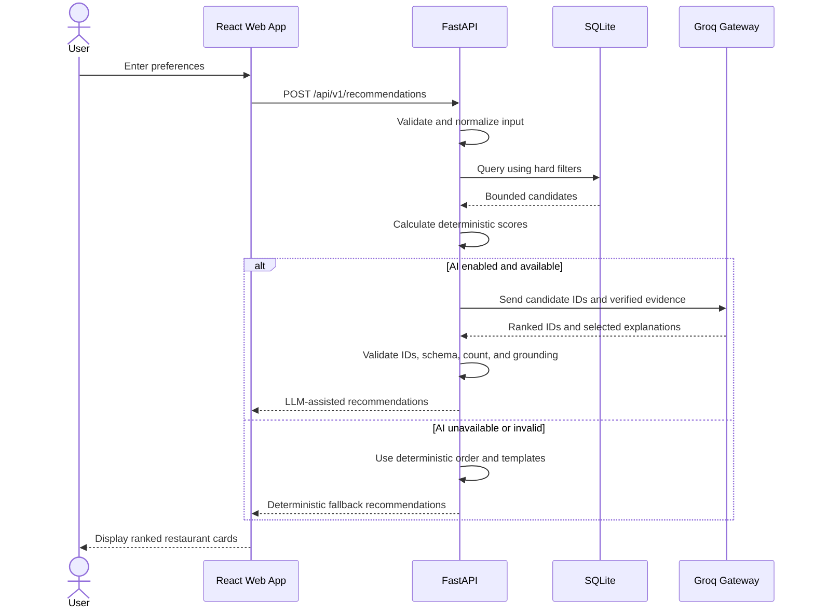
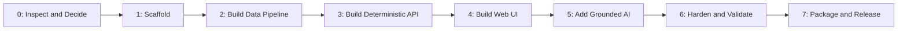
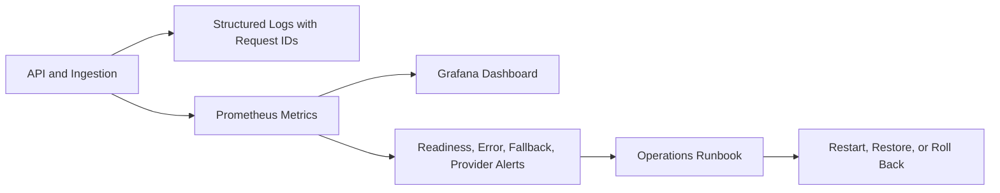
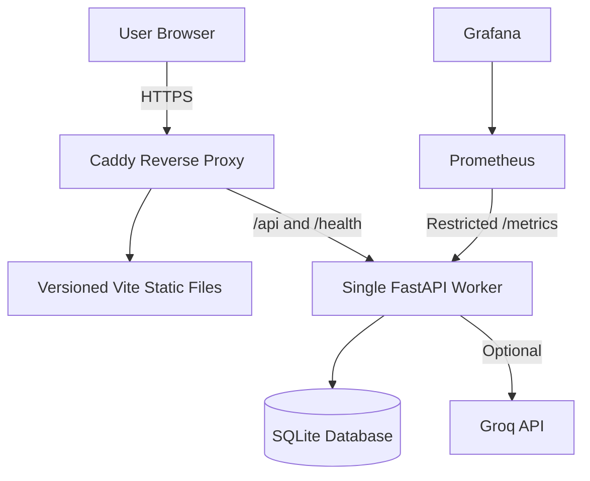

# TableMind Project Document

## 1. Project Summary

TableMind is an AI-assisted restaurant recommendation application built from a real Zomato
dataset. A user selects a Bengaluru locality, budget, cuisines, minimum rating, optional
preferences, and result count. The application filters eligible restaurants, scores them, and can
ask Groq to reorder the shortlist and select grounded explanations.

The most important safety rule is:

> Application code decides which restaurants are eligible. The LLM may only reorder those
> restaurants and select explanations supported by known evidence.

If Groq is disabled, unavailable, rate-limited, slow, or returns invalid output, the user still
receives deterministic recommendations.

## 2. Goals and Scope

### Implemented

- Bengaluru locality search.
- Low, medium, high, and custom-maximum budgets in INR for two people.
- Optional cuisine and minimum-rating filters.
- Free-text preferences handled as soft, untrusted input.
- Deterministic filtering, scoring, and explanations.
- Optional Groq reranking and grounded explanations.
- Automatic deterministic fallback.
- Responsive and keyboard-accessible React interface.
- Versioned ingestion, data-quality checks, monitoring, backups, and rollback support.

### Outside the MVP

- Restaurant booking, ordering, payment, or delivery.
- Live menus, availability, opening hours, or current pricing.
- User accounts and recommendation history.
- Multi-city or nearby-distance search.
- Unverified dietary, allergen, ambience, or family-friendly claims.

## 3. High-Level Architecture

The system is a modular monolith: one React frontend, one FastAPI backend, one SQLite serving
database, and a separate offline ingestion pipeline.



### Why this structure

- The application remains useful without an AI provider.
- Database facts never depend on generated text.
- Modules can be tested independently.
- A single native deployment is simple to run and support.
- PostgreSQL can be introduced later if measured concurrency requires it.

## 4. Main Components

| Component | Responsibility | Location |
|---|---|---|
| Web application | Preference form, validation, loading/error states, result cards | `apps/web` |
| API routes | Versioned endpoints, health checks, metrics, request contracts | `apps/api/app/api` |
| Recommendation engine | Filtering, scoring, orchestration, fallback | `apps/api/app/recommendations` |
| LLM gateway | Groq calls, timeouts, retries, circuit breaker, validation | `apps/api/app/llm` |
| Repository | Parameterized SQLite queries and dataset-version access | `apps/api/app/repositories` |
| Ingestion pipeline | Acquisition, normalization, quality checks, publication | `pipelines` |
| Database schema | Tables, relationships, and indexes | `migrations` |
| Evaluation suite | Relevance, grounding, latency, usage, and cost checks | `evals` |
| Operations assets | Monitoring, HTTPS, release, backup, and startup tools | `ops`, `scripts` |

## 5. Data Pipeline

The source is pinned to a specific Hugging Face revision so ingestion can be reproduced. Raw rows
are cleaned, normalized, deduplicated, validated, and written to a canonical Parquet snapshot and
the serving database. A failed run never replaces the active dataset.



### Current dataset facts

| Item | Value |
|---|---|
| Source | `ManikaSaini/zomato-restaurant-recommendation` |
| Source revision | `5738e9eda2fad49ad51c6e0ed26e761d9b947133` |
| Coverage | Bengaluru localities |
| Raw rows | 51,717 |
| Canonical restaurants | 12,372 |
| Duplicates removed | 38,854 |
| Rejected rows | 491 |
| Cost meaning | Estimated INR cost for two people |
| Rating scale | 0–5; `NEW`, `-`, blank, and invalid values become unknown |

The source license is unspecified. Public distribution or production use remains blocked until
permission is established or the source is replaced with a suitably licensed dataset.

## 6. Recommendation Workflow



### Hard filters

The backend applies these before any model call:

1. Exact normalized Bengaluru locality.
2. Known cost within the selected budget.
3. Known rating at or above the requested minimum.
4. At least one requested cuisine.

No filter is silently relaxed. A no-match response suggests changes, but the user must explicitly
submit the revised search.

### Deterministic score

```text
score =
    0.35 × rating
  + 0.30 × cuisine match
  + 0.20 × budget fit
  + 0.15 × verified preference evidence
```

Ties are resolved by score, rating, votes, and stable restaurant ID. Unsupported preferences do
not increase the score and are labelled as unverified.

### LLM safeguards

- Only a bounded deterministic shortlist is sent to Groq.
- Optional user text is clearly delimited as untrusted data.
- The model can return only supplied restaurant IDs.
- Names, cuisines, ratings, costs, and URLs are hydrated from the database.
- Output must pass a strict schema and grounding validator.
- At most one shared retry or repair is allowed.
- Timeout, rate limit, outage, invalid JSON, or unsafe content triggers deterministic fallback.

## 7. API Overview

| Endpoint | Purpose |
|---|---|
| `POST /api/v1/recommendations` | Generate ranked recommendations |
| `GET /api/v1/metadata/locations` | Search supported localities |
| `GET /api/v1/metadata/cuisines` | List available cuisines, optionally by locality |
| `GET /api/v1/metadata/budget-bands` | Return configured budget choices |
| `GET /health/live` | Confirm that the API process is running |
| `GET /health/ready` | Confirm database access and an active dataset |
| `GET /metrics` | Export Prometheus-compatible operational metrics |

Every recommendation response includes a request ID, dataset version, candidate count, ranking
mode, and applied relaxation metadata.

## 8. Simplified Implementation Journey



| Phase | Simplified result | Status |
|---|---|---|
| 0 | Verified dataset assumptions and product rules | Complete |
| 1 | Created backend, frontend, tests, and developer tooling | Complete |
| 2 | Built reproducible ingestion and serving database | Complete |
| 3 | Added deterministic metadata and recommendation APIs | Complete |
| 4 | Added responsive end-to-end web workflow | Complete |
| 5 | Added grounded Groq ranking, evaluation, and fallback | Complete |
| 6 | Added security, observability, load tests, accessibility, and recovery | Complete |
| 7 | Added native packaging, staging rehearsal, HTTPS example, and runbooks | In progress |

There is no planned Phase 8. Remaining work belongs to Phase 7 production deployment and formal
sign-off.

## 9. Run the Project Without Docker

### Prerequisites

- Python 3.12
- Node.js 22 and npm
- A private Groq API key only when AI ranking is enabled

### First-time setup

```powershell
python -m venv .venv
.\.venv\Scripts\Activate.ps1
python -m pip install -r requirements-dev.lock
cd apps/web
npm ci
cd ../..
```

Copy `.env.example` to `.env`. Keep `APP_LLM_ENABLED=false` for deterministic mode. For AI mode,
set `APP_LLM_ENABLED=true`, select the tested model, and place `APP_GROQ_API_KEY` only in the
ignored server-side `.env` file.

### Build the local dataset

For the small development fixture:

```powershell
python -m pipelines.cli --mode fixture
```

For the pinned full dataset:

```powershell
python -m pipelines.cli --mode huggingface
```

### Start the backend

```powershell
.\.venv\Scripts\python.exe -m uvicorn app.main:app --app-dir apps/api --reload --host 127.0.0.1 --port 8000
```

### Start the frontend in a second terminal

```powershell
cd apps/web
npm run dev
```

Open:

- Application: <http://127.0.0.1:5173>
- API documentation: <http://127.0.0.1:8000/docs>
- Readiness: <http://127.0.0.1:8000/health/ready>

## 10. Security and Privacy

- Request bodies, text lengths, lists, numeric values, and result counts are bounded.
- Recommendation and LLM requests have separate rate limits.
- Production requires explicit CORS origins and rejects wildcards.
- SQL queries use parameters.
- API keys remain server-side and are redacted from logs.
- Raw optional-preference text is omitted from normal logs.
- Restaurant strings are rendered as text, not executable markup.
- The metrics endpoint should be reachable only by monitoring systems in production.
- The MVP intentionally has no user accounts or stored preference history.

## 11. Observability and Reliability



Metrics cover endpoint latency, errors, no matches, model fallback, invalid model output, token
usage, estimated cost, ingestion freshness, accepted rows, and rejected rows. Failures of the
database, active dataset, model, and ingestion pipeline have automated tests and documented
recovery actions.

SQLite backups use its online backup API, run an integrity check, record a SHA-256 hash, and retain
a safety copy before restore. The deployment is limited to one writable API instance. Multiple
writers or horizontal scaling require reopening the PostgreSQL decision.

## 12. Quality Evidence

The final Phase 6 validation recorded:

- 132 passing Pytest tests.
- Strict Mypy and Ruff checks passing.
- 19 passing Vitest component tests.
- 15 passing Playwright scenarios across desktop, tablet, and mobile Chromium.
- Zero axe violations in the tested primary workflow.
- Candidate-query p95 of 7.066 ms.
- Deterministic recommendation p95 of 7.551 ms.
- Simulated model-assisted p95 of 80.661 ms with a 50 ms model delay.
- 200 requests at concurrency 10 with zero failures.
- 50 simulated provider failures with successful deterministic fallback.

## 13. Native Deployment



The release builder runs quality gates, creates an optimized package, writes file checksums, and
adds a release manifest. Caddy provides HTTPS, compression, security headers, static hosting, and
API reverse proxying. Development, staging, and production configurations are separate.

Build a native release candidate with:

```powershell
powershell -ExecutionPolicy Bypass -File scripts/build_release.ps1 -Version 0.1.0-rc1
```

Detailed installation, dataset activation, backup, incident, and rollback steps are in
`docs/operations-runbook.md`.

## 14. Current Status and Remaining Work

Phases 0–6 are complete for the native single-instance architecture. Phase 7 has a tested local
release candidate and staging rehearsal, but the application has not been publicly deployed.

Before public launch:

1. Obtain dataset production-use permission or replace the dataset.
2. Select the host, domain, HTTPS endpoint, monitoring destination, and secret manager.
3. Install the API and Caddy as least-privilege managed services.
4. Rehearse application and database rollback on the selected staging host.
5. Complete a human NVDA or Narrator acceptance session.
6. Run production smoke, AI, fallback, monitoring, and secret-leak checks.
7. Obtain product, engineering, data, security, and accessibility sign-off.

## 15. Key Project Documents

- `problemStatement.md` — original requirement.
- `architecture.md` — detailed architecture and contracts.
- `implementation-plan.md` — phase-by-phase implementation record.
- `edge-case.md` — corner cases and expected handling.
- `docs/data-profile.md` — source inspection and data semantics.
- `docs/product-rules.md` — approved filtering and presentation rules.
- `docs/phase-6-validation.md` — release-candidate hardening evidence.
- `docs/phase-7-release-status.md` — deployment readiness and blockers.
- `docs/operations-runbook.md` — deployment, monitoring, and recovery procedures.
- `docs/release-checklist.md` — remaining public-launch approvals.
