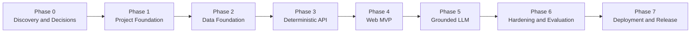

# AI-Powered Restaurant Recommendation System — Phase-Wise Implementation Plan

## 1. Plan Purpose

This plan translates [problemStatement.md](problemStatement.md) and [architecture.md](architecture.md) into an ordered implementation backlog. It is designed to deliver a usable deterministic recommendation product first, then add grounded LLM ranking and explanations without making the core experience dependent on model availability.

The plan follows these implementation principles:

- Structured application code enforces location, budget, cuisine, and rating constraints.
- The LLM only reranks a bounded candidate set and explains verified matches.
- Every phase ends with a demonstrable, testable outcome.
- Failed ingestion never replaces the last valid dataset.
- Failed or invalid LLM output falls back to deterministic recommendations.
- Existing unrelated workspace files, including the current root `index.html`, remain unchanged unless a later implementation decision explicitly replaces them.

## 2. Delivery Overview

| Phase | Outcome | Depends on |
|---|---|---|
| 0. Discovery and decisions | Verified data assumptions and recorded implementation choices | None |
| 1. Project foundation | Runnable backend/frontend skeleton with quality tooling | Phase 0 |
| 2. Data foundation | Reproducible canonical dataset and queryable restaurant store | Phase 1 |
| 3. Deterministic API | Tested filter, score, and recommendation APIs without an LLM | Phase 2 |
| 4. Web MVP | Complete browser journey using deterministic recommendations | Phase 3 |
| 5. Grounded LLM | Validated reranking and explanations with automatic fallback | Phases 3–4 |
| 6. Hardening and evaluation | Secure, observable, accessible, and performance-tested release candidate | Phase 5 |
| 7. Deployment and release | Reproducible deployment, operational docs, and signed-off MVP | Phase 6 |

## 3. Target Stack and Working Assumptions

Unless Phase 0 establishes a reason to change them, implementation will use:

- React, TypeScript, and Vite for the web client.
- Python 3.12, FastAPI, and Pydantic for the API.
- Hugging Face `datasets` plus Polars or pandas for ingestion.
- Canonical Parquet snapshots for reproducibility.
- SQLite for local development and PostgreSQL for production-scale deployment.
- A provider-neutral LLM adapter with schema-constrained JSON output.
- Pytest, Vitest, and Playwright for automated tests.
- Docker Compose for a consistent local environment.

Suggested budget defaults are configuration rather than business facts:

- Low: up to ₹600.
- Medium: ₹601–₹1,500.
- High: above ₹1,500.

The meaning of the source cost field and its currency must be verified before these bands are enabled.

## 4. Delivery Conventions

### Task Status

- `[ ]` Not started.
- `[~]` In progress.
- `[x]` Complete and verified.
- `[!]` Blocked with reason documented.

### Completion Evidence

A task is not complete merely because code exists. Its pull request or work log should include applicable evidence:

- Test names and results.
- API request/response sample.
- Data-quality report or manifest.
- Screenshot or browser-test result for UI work.
- Performance or evaluation results for non-functional work.
- Documentation updates when behavior or configuration changes.

### Definition of Ready

A phase is ready to start when:

- Its dependency phases have met their exit criteria.
- Required decisions, sample data, and environment access are available.
- Acceptance criteria are understood and testable.
- Any deliberate scope change is reflected in this plan and the architecture.

### Definition of Done

A task or phase is done when:

- Functional acceptance criteria pass.
- Relevant automated tests pass locally and in CI.
- Error and fallback behavior is covered.
- No secrets or generated private data are committed.
- Documentation and configuration examples match the implemented behavior.
- Known limitations are recorded rather than hidden.

## 5. Phase 0 — Discovery and Architecture Decisions

### Objective

Remove data and product ambiguity before scaffolding behavior around incorrect assumptions.

**Status:** Complete on 2026-09-13. Evidence is recorded in [the dataset profile](docs/data-profile.md), [MVP product rules](docs/product-rules.md), the representative [Phase 0 sample](data/samples/zomato-phase0-sample.csv), and [architecture decision records](docs/adr/). Production use remains gated on clarification of the source dataset's unspecified license.

### Tasks

#### P0.1 — Inspect the Source Dataset

- [x] Confirm that the Hugging Face dataset can be accessed from the development environment.
- [x] Record the repository name, available configurations/splits, revision, license, and approximate size.
- [x] Produce a schema profile containing column names, inferred types, row counts, null percentages, and representative values.
- [x] Identify the source columns for name, location, city, cuisines, cost, rating, votes, address, source ID, and source URL.
- [x] Determine the rating scale and invalid rating tokens.
- [x] Determine the cost currency and whether cost means per person, for two people, or something else.
- [x] Identify duplicate patterns and the best stable-identity fields.
- [x] Record which optional preferences are supported by source evidence.

Deliverables:

- `docs/data-profile.md`.
- A small, non-sensitive representative fixture under `data/samples/`.
- A proposed source-to-canonical mapping.

#### P0.2 — Confirm Product Rules

- [x] Confirm whether cuisine matching means any selected cuisine or all selected cuisines. Default: any.
- [x] Confirm default and maximum recommendation counts. Proposed default: 5; maximum: 10.
- [x] Confirm budget bands after validating cost semantics.
- [x] Confirm whether no-match filter relaxation requires user approval. Default: yes.
- [x] Define how unknown rating and cost values affect eligibility. Default: exclude when the user specified that constraint.
- [x] Decide whether optional preferences are free text only or include predefined tags.
- [x] Define the wording used when a preference such as `family-friendly` cannot be verified.

Deliverable:

- `docs/product-rules.md` containing approved rules and examples.

#### P0.3 — Record Technical Decisions

- [x] Confirm local SQLite and production PostgreSQL strategy.
- [x] Select the initial LLM provider/model without coupling domain code to it.
- [x] Confirm required deployment environment and allowed web origins.
- [x] Decide whether authentication is excluded from the MVP. Default: excluded.
- [x] Record architecture decisions as short ADRs.

Suggested ADRs:

- `ADR-001-modular-monolith.md`.
- `ADR-002-deterministic-filtering-before-llm.md`.
- `ADR-003-versioned-offline-ingestion.md`.
- `ADR-004-provider-neutral-llm-gateway.md`.

### Validation

- Dataset profile is reviewed against actual downloaded data.
- Every required problem-statement field is either mapped or explicitly marked unavailable.
- Cost and rating semantics are documented rather than inferred in code.
- Product rules have unambiguous examples and boundary cases.

### Exit Criteria

- Source revision and canonical mapping are agreed.
- Budget, rating, cuisine, result-count, and no-match rules are recorded.
- No unresolved decision blocks project scaffolding or canonical schema design.

## 6. Phase 1 — Project Foundation

### Objective

Create a reproducible development baseline with clear module boundaries and automated quality checks.

**Status:** Complete on 2026-09-13. Local evidence: Ruff and formatting checks passed; strict MyPy passed; 8 backend tests passed; frontend ESLint, strict TypeScript, 1 component test, and production build passed; clean `npm ci` passed; and 1 Chromium Playwright smoke test passed. See the [Phase 1 validation record](docs/phase-1-validation.md). CI and Docker definitions were parsed and their referenced inputs were verified, but were not executed remotely because this workspace is not a Git repository and Docker is not installed locally.

### Tasks

#### P1.1 — Create the Repository Structure

- [x] Add `apps/api`, `apps/web`, `pipelines`, `migrations`, `evals`, `data/manifests`, `data/samples`, and `docs` directories.
- [x] Keep large raw datasets, generated databases, model responses, environment files, and build output out of version control.
- [x] Add a root README that explains setup, development commands, test commands, and the high-level data flow.
- [x] Preserve the existing root `index.html`; place the new web application under `apps/web`.

#### P1.2 — Scaffold the Backend

- [x] Initialize the Python project and lock dependencies.
- [x] Create FastAPI application startup and shutdown handling.
- [x] Add typed settings loaded from environment variables.
- [x] Add structured logging and request/correlation IDs.
- [x] Create domain, recommendation, repository, LLM, route, and core modules.
- [x] Add `/health/live` with a minimal automated test.

#### P1.3 — Scaffold the Web Client

- [x] Initialize React, TypeScript, and Vite under `apps/web`.
- [x] Add routing or a single application shell appropriate to the MVP.
- [x] Establish design tokens for color, spacing, typography, focus states, and responsive breakpoints.
- [x] Add an API client boundary and typed request/response models.
- [x] Add a basic application-render test.

#### P1.4 — Add Development Quality Controls

- [x] Configure backend formatting, linting, and type checking.
- [x] Configure frontend formatting, linting, and TypeScript checking.
- [x] Configure Pytest and Vitest.
- [x] Configure Playwright with a placeholder smoke test.
- [x] Add pre-commit hooks or equivalent local checks.
- [x] Add CI jobs for lint, types, unit tests, and build.
- [x] Add `.env.example` with variable names and safe placeholder values only.

#### P1.5 — Add Local Runtime Configuration

- [x] Add Dockerfiles for API and web builds.
- [x] Add a Docker Compose baseline without requiring an LLM key to start.
- [x] Document native and containerized startup paths.
- [x] Ensure generated state is stored in explicit ignored directories.

### Validation

- Backend and frontend start independently.
- `/health/live` returns HTTP 200.
- The browser smoke test loads the new application shell.
- Linting, type checks, unit tests, and builds pass in CI.
- Startup succeeds without LLM credentials when LLM features are disabled.

### Exit Criteria

- A new developer can clone, configure, run, and test the empty application from documented commands.
- Module boundaries match the architecture document.
- No credentials, datasets, or generated databases are committed.

## 7. Phase 2 — Data Foundation

### Objective

Build a repeatable ingestion pipeline that converts the source dataset into a validated, versioned, queryable restaurant store.

### Tasks

#### P2.1 — Implement Dataset Acquisition

- [x] Add a CLI command to download the configured Hugging Face dataset revision.
- [x] Support an explicit local fixture mode for tests.
- [x] Capture source repository, configuration, split, revision, retrieval time, and content hash.
- [x] Fail with an actionable error if the dataset or revision is unavailable.
- [x] Avoid redownloading an identical immutable revision unnecessarily.

#### P2.2 — Implement Source Profiling and Mapping

- [x] Generate a machine-readable and human-readable schema profile.
- [x] Define explicit versioned source-to-canonical column mappings.
- [x] Validate required columns before row transformation.
- [x] Ensure unexpected source-schema changes fail safely.
- [x] Add mapping tests based on the Phase 0 fixture.

#### P2.3 — Implement Normalization

- [x] Trim and collapse whitespace while preserving display values.
- [x] Normalize location and cuisine search values using Unicode-safe case folding.
- [x] Parse multi-value cuisine fields into normalized values.
- [x] Parse cost values without treating missing values as zero.
- [x] Parse valid ratings and convert tokens such as `NEW`, `-`, or empty values to null.
- [x] Normalize vote counts when present.
- [x] Set explicit currency, cost basis, and rating scale from the approved mapping.
- [x] Create stable restaurant IDs from a source ID or documented identity hash.
- [x] Retain source lineage fields needed for traceability.

#### P2.4 — Validate and Deduplicate

- [x] Enforce required restaurant name and location rules.
- [x] Enforce accepted rating and cost ranges.
- [x] Detect duplicate stable IDs.
- [x] Resolve duplicates using a documented deterministic rule.
- [x] Quarantine rejected rows with non-sensitive reason codes.
- [x] Set quality thresholds that prevent publishing a severely degraded dataset.

#### P2.5 — Produce Canonical Artifacts

- [x] Write a versioned canonical Parquet snapshot.
- [x] Write a dataset manifest with hashes, counts, mapping version, pipeline version, and rejection summary.
- [x] Make writes atomic so incomplete artifacts are not published.
- [x] Retain the previous successful snapshot for rollback.

#### P2.6 — Build the Serving Database

- [x] Define database migrations for restaurants, cuisines, restaurant-cuisine relationships or arrays, verified tags, and dataset manifests.
- [x] Implement transactional load/upsert behavior.
- [x] Create indexes for normalized location, rating, cost, and cuisine lookup.
- [x] Activate the new dataset version only after loading and validation succeed.
- [x] Implement repository queries against SQLite.
- [x] Keep SQL compatible with the planned PostgreSQL repository or isolate dialect differences.

#### P2.7 — Add Data Tests

- [x] Unit-test each parser and normalizer boundary.
- [x] Test stable IDs and deduplication across repeated runs.
- [x] Test missing, malformed, and out-of-range data.
- [x] Run a full fixture ingestion twice and verify identical canonical results.
- [x] Test that a failed ingestion leaves the previous active version unchanged.

### Validation

- The pinned input produces a deterministic canonical snapshot and manifest.
- Canonical records contain valid IDs and required fields.
- Missing cost or rating remains null.
- Database indexes are present and candidate queries avoid full-table loading.
- An ingestion report accounts for accepted, rejected, and deduplicated rows.

### Exit Criteria

- One command builds a queryable local restaurant database from the pinned source or test fixture.
- Dataset lineage and quality are auditable.
- A failed run cannot replace the last successful dataset.

## 8. Phase 3 — Deterministic Recommendation API

### Objective

Deliver correct, explainable recommendations without any dependency on an LLM.

### Tasks

#### P3.1 — Implement Domain and API Contracts

- [x] Define Pydantic models for budget, preferences, recommendation request, result, metadata, and errors.
- [x] Validate location length, cuisine count, rating range, result limit, and optional-text length.
- [x] Version endpoints under `/api/v1`.
- [x] Generate and review the OpenAPI contract.
- [x] Ensure factual response fields are always backend-owned.

#### P3.2 — Implement Metadata APIs

- [x] Add `GET /api/v1/metadata/locations` with bounded autocomplete.
- [x] Add `GET /api/v1/metadata/cuisines`, optionally filtered by location.
- [x] Add `GET /api/v1/metadata/budget-bands` from validated configuration.
- [x] Add short-lived or dataset-versioned caching for metadata.
- [x] Return only values present in the active dataset.

#### P3.3 — Implement Candidate Filtering

- [x] Normalize request fields using the same rules as ingestion.
- [x] Enforce location as a hard filter.
- [x] Enforce minimum rating when supplied.
- [x] Resolve budget bands to numeric constraints and enforce them.
- [x] Apply the approved any/all cuisine matching policy.
- [x] Exclude unknown numeric values when their corresponding constraint is active.
- [x] Bound query results before application-layer scoring.
- [x] Return an explicit no-match response without silently relaxing filters.

#### P3.4 — Implement Deterministic Scoring

- [x] Implement normalized rating, cuisine match, budget fit, and supported-preference evidence features.
- [x] Store weights in typed configuration.
- [x] Add deterministic tie-breaking, such as score, rating, vote confidence when available, then stable ID.
- [x] Retain feature-level score information for tests and internal diagnostics.
- [x] Avoid rewarding unsupported optional preferences.
- [x] Cap the candidate set prepared for later LLM reranking.

#### P3.5 — Implement Recommendation Orchestration

- [x] Orchestrate normalization, query, scoring, ranking, hydration, and response construction.
- [x] Return `ranking_mode: deterministic`.
- [x] Include dataset version, candidate count, and filter-relaxation metadata.
- [x] Produce template-based explanations using verified matches.
- [x] List optional preferences that could not be verified.
- [x] Generate a request ID for every response and error.

#### P3.6 — Implement Errors and Readiness

- [x] Return stable error codes for validation, no matches, dataset unavailable, rate limit, and internal failure.
- [x] Keep stack traces and database details out of client responses.
- [x] Add `/health/ready` that checks database access and an active dataset.
- [x] Ensure liveness does not depend on the LLM provider.

#### P3.7 — Test the Recommendation API

- [x] Unit-test all filters, budget boundaries, scores, and tie-breaks.
- [x] Verify every returned result satisfies active hard constraints.
- [x] Test missing rating/cost behavior.
- [x] Test no-match and invalid-input contracts.
- [x] Test repository queries against a temporary database.
- [x] Add contract snapshots or schema compatibility checks.
- [x] Measure candidate-query latency on the available dataset.

### Validation

- Example requests for Delhi and Bangalore return only matching locations.
- Results respect cuisine, rating, and budget boundaries.
- The same request and dataset version produce the same ordering.
- Unsupported optional preferences are labelled unverified.
- The API remains fully functional with no LLM configuration.

### Exit Criteria

- `POST /api/v1/recommendations` delivers tested deterministic recommendations.
- Supporting metadata and health endpoints are operational.
- All hard-filter invariant tests pass.

## 9. Phase 4 — Web MVP

### Objective

Provide a complete, accessible user journey for entering preferences, reviewing recommendations, and refining searches.

### Tasks

#### P4.1 — Build the Preference Form

- [x] Add a searchable location selector backed by the metadata API.
- [x] Add low, medium, high, and optional custom maximum budget controls.
- [x] Add a cuisine multi-select that updates from available metadata.
- [x] Add a minimum-rating control with a clear scale.
- [x] Add optional-preferences text input with examples and a length indicator.
- [x] Add a bounded result-count selector.
- [x] Provide accessible labels, descriptions, validation messages, and keyboard behavior.

#### P4.2 — Build Submission and State Handling

- [x] Integrate the typed API client.
- [x] Prevent duplicate submissions while a request is active.
- [x] Preserve the form state after success or failure.
- [x] Add a meaningful loading state.
- [x] Support request cancellation or ignore stale responses after filter changes.
- [x] Show actionable validation, network, service, and no-match messages.

#### P4.3 — Build Recommendation Results

- [x] Display restaurant name, location, cuisines, rating, estimated cost, and explanation.
- [x] Label cost basis and currency accurately.
- [x] Display matched and unverified preferences distinctly.
- [x] Preserve backend ranking order.
- [x] Show dataset freshness/version in a low-emphasis details area.
- [x] Avoid representing the dataset as live availability.

#### P4.4 — Build Empty and Refinement States

- [x] Show why no exact result was found without exposing internal query details.
- [x] Present suggested filter changes separately from applied filters.
- [x] Require user action before applying relaxed constraints.
- [x] Keep prior selections available for quick refinement.

#### P4.5 — Responsive and Accessible UX

- [x] Support mobile, tablet, and desktop layouts.
- [x] Use visible focus indicators and logical tab order.
- [x] Announce loading, result count, and errors through appropriate live regions.
- [x] Meet WCAG AA color contrast for core UI.
- [x] Respect reduced-motion preferences.
- [x] Test zoom and long restaurant/cuisine names.

#### P4.6 — Test the Browser Journey

- [x] Component-test form validation and result cards.
- [x] Test loading, success, no-match, validation-error, and server-error states.
- [x] Add Playwright coverage for a complete search and refinement.
- [x] Run automated accessibility checks and manually inspect keyboard flow.
- [x] Verify supported mobile and desktop viewports.

Implementation and local validation evidence: [Phase 4 validation record](docs/phase-4-validation.md).

### Validation

- A user can complete the entire workflow without developer tools.
- All problem-statement inputs and outputs are represented.
- Errors and no-match states provide a next action.
- The interface is keyboard-usable and responsive.

### Exit Criteria

- The deterministic MVP works end to end in a browser.
- Primary browser and accessibility tests pass.
- Product stakeholders can validate ranking inputs and result presentation before LLM behavior is introduced.

## 10. Phase 5 — Grounded LLM Ranking and Explanations

Status (2026-09-19): complete. The grounded Groq integration, rate-aware evaluation pacing,
human judgments, pricing, and three-trial `restaurant-eval-v2` release evaluation are complete.
`openai/gpt-oss-120b` passed with zero fallback, zero safety/count violations, complete usage,
p95 latency below eight seconds, mean cost below the configured gate, and no NDCG regression.
See [validation evidence](docs/phase-5-validation.md), the
[final report](evals/results/phase5-groq-v2-final.json), and [evaluation setup](evals/README.md).

### Objective

Enhance deterministic candidates with personalized ranking and natural explanations while preserving factual and availability safeguards.

### Tasks

#### P5.1 — Establish the Baseline Evaluation Set

- [x] Create representative cases across locations, budgets, cuisines, rating boundaries, and optional preferences.
- [x] Record expected hard constraints for every case.
- [x] Add human relevance judgments for a subset of valid candidates.
- [x] Measure deterministic baseline relevance, latency, and empty-result rate.
- [x] Version evaluation cases and results.

#### P5.2 — Implement the Provider-Neutral LLM Gateway

- [x] Define the `RecommendationModel` interface.
- [x] Implement a fake model for unit and integration tests.
- [x] Implement the selected provider adapter in an isolated module.
- [x] Add typed provider configuration, timeouts, token caps, and at most one transient retry.
- [x] Capture model name, latency, token usage, and error category.
- [x] Ensure API keys never reach client code or logs.

#### P5.3 — Design the Grounded Prompt

- [x] Send only the bounded top deterministic candidates.
- [x] Include candidate IDs and the minimum facts needed for ranking.
- [x] Delimit optional user text as untrusted preference data.
- [x] Instruct the model to return only supplied IDs.
- [x] Prohibit invented prices, ratings, restaurant attributes, and availability claims.
- [x] Require unsupported preferences to be listed as unverified.
- [x] Request concise explanations and an optional summary.
- [x] Version the system prompt and output schema.

#### P5.4 — Implement Structured Output Validation

- [x] Parse model output into a strict Pydantic schema.
- [x] Reject unknown, duplicate, or excess restaurant IDs.
- [x] Reject malformed or overlong explanations.
- [x] Check explanations for unsupported numeric claims.
- [x] Hydrate names, cuisines, rating, and cost from the database after validation.
- [x] Attempt one bounded repair only for recoverable schema failures.
- [x] Never return unvalidated model content to the client.

#### P5.5 — Add Fallback and Resilience

- [x] Fall back on timeout, rate limiting, provider outage, invalid JSON, failed grounding, or exhausted retry.
- [x] Return deterministic results with `ranking_mode: deterministic_fallback`.
- [x] Keep fallback explanations grounded and template-based.
- [x] Add a circuit breaker for repeated provider failures.
- [x] Keep readiness healthy when the dataset is usable but the LLM is unavailable.

#### P5.6 — Integrate LLM Results into the UI

- [x] Render LLM-assisted and fallback responses through the same result component.
- [x] Avoid exposing technical provider errors to users.
- [x] Use low-emphasis transparency text if ranking falls back, where product rules require it.
- [x] Display the optional summary only when valid and useful.

#### P5.7 — Test and Evaluate LLM Behavior

- [x] Test valid output, invalid output, unknown IDs, duplicates, excessive results, and timeout behavior with fakes.
- [x] Add prompt-injection test cases in optional-preference text.
- [x] Run the versioned evaluation set against the configured model.
- [x] Verify zero hard-filter violations and zero unknown restaurant IDs.
- [x] Measure unsupported-claim rate, latency, token usage, and estimated cost.
- [x] Compare relevance against the deterministic baseline.
- [x] Record model, prompt, dataset, and evaluation versions.

The final three-trial live report records all required safety, relevance, latency, usage, and
cost evidence. Its release gate passed without exceptions or threshold changes. Phase 6 is now
ready to begin; this does not remove its production hardening, load, security, or operations work.

### Validation

- The model can only influence order and grounded explanation text.
- All factual display fields originate from the serving database.
- LLM failure produces useful results rather than an API failure.
- Evaluation shows acceptable relevance without hard-constraint or grounding regressions.

### Exit Criteria

- LLM-assisted ranking and explanations work end to end.
- Invalid model output is never returned to users.
- Automated fallback tests and the release evaluation set pass.

## 11. Phase 6 — Production Hardening and Quality

### Objective

Turn the feature-complete application into a secure, observable, performant, and supportable release candidate.

**Status:** Complete on 2026-09-19 for the approved native, non-container, single-instance MVP.
PostgreSQL is explicitly deferred by [ADR-006](docs/adr/ADR-006-native-sqlite-mvp.md), based on
measured capacity rather than represented as tested. See the consolidated
[Phase 6 validation record](docs/phase-6-validation.md).

### Tasks

#### P6.1 — Security Controls

- [x] Apply strict request sizes, field lengths, enums, and numeric ranges.
- [x] Add API rate limiting, with stricter controls on LLM-backed requests.
- [x] Configure production CORS for known origins only.
- [x] Use parameterized queries everywhere.
- [x] Review prompt-injection boundaries and model-output handling.
- [x] Redact or omit free-text preferences and credentials from logs.
- [x] Run dependency vulnerability scans; container-image scanning is not applicable to the approved non-container deployment path.
- [x] Confirm client bundles contain no server secrets.

#### P6.2 — Observability

- [x] Emit structured logs with request IDs.
- [x] Add metrics for endpoint latency, errors, no matches, fallback rate, invalid model output, tokens, and estimated cost.
- [x] Add ingestion metrics for freshness, accepted rows, and rejection rate.
- [x] Tag recommendation telemetry with dataset, prompt, and model versions.
- [x] Add dashboards and actionable alerts for readiness, error rate, and provider failures.
- [x] Ensure high-cardinality user or restaurant data is not used as metric labels.

#### P6.3 — Performance and Reliability

- [x] Benchmark metadata, candidate queries, deterministic recommendations, and LLM-assisted requests.
- [x] Inspect query plans for primary filters.
- [x] Configure database connection lifecycle and graceful shutdown; SQLite uses operation-scoped connections, while PostgreSQL pooling belongs to P6.4.
- [x] Cache metadata by dataset version.
- [x] Add end-to-end timeouts and bounded concurrency.
- [x] Load-test expected traffic and failure scenarios.
- [x] Add Redis only if measured traffic shows a justified need; current measurements do not justify it.
- [x] Verify transactional dataset activation and rollback.

Target checks:

- Metadata p95 under 300 ms in-region.
- Deterministic recommendation p95 under 1 second.
- LLM-assisted recommendation p95 under 8 seconds, subject to provider behavior.
- Deterministic fallback succeeds whenever the database is healthy.

#### P6.4 — Production Database Decision

- [x] Record PostgreSQL as deferred for this native MVP; no PostgreSQL validation is claimed.
- [x] Validate SQLite indexes and query plans with the 12,372-row production snapshot.
- [x] Test transactional dataset publication and rollback on SQLite.
- [x] Implement and test integrity-checked SQLite backup and guarded restore.
- [x] Document the single-writer constraint and scale triggers that reopen PostgreSQL work.

#### P6.5 — Accessibility and Browser Quality

- [x] Complete an automated WCAG AA review of the primary workflow.
- [x] Test keyboard-only navigation and programmatic screen-reader semantics.
- [x] Test the supported current Chromium browser family and responsive breakpoints.
- [x] Verify reduced motion, zoom, contrast, and error announcements.
- [x] Fix all critical accessibility issues; human NVDA/Narrator acceptance remains a Phase 7 launch item.

#### P6.6 — Operational Failure Exercises

- [x] Simulate database unavailability.
- [x] Simulate missing active dataset.
- [x] Simulate LLM timeout, rate limit, malformed output, and sustained outage.
- [x] Simulate failed dataset ingestion and activation.
- [x] Confirm logs, metrics, alerts, client behavior, and recovery steps for each scenario.

### Validation

- Security, dependency, performance, accessibility, and reliability checks pass.
- Dashboards distinguish data, database, API, and model failures.
- The system meets stated latency targets or documented exceptions are approved.
- Rollback procedures are tested rather than assumed.

### Exit Criteria

- A release candidate satisfies functional and non-functional requirements.
- No critical security, accessibility, data-quality, or grounding defect remains open.
- Operations can detect and recover from defined failure scenarios.

## 12. Phase 7 — Deployment, Documentation, and MVP Release

### Objective

Deploy reproducibly, verify the live system, and hand over enough documentation to operate and extend it safely.

**Status:** In progress. Native release packaging, CI, local staging, HTTPS configuration, backup,
rollback, and operations documentation are complete. External production deployment and sign-off
remain blocked by the unspecified dataset license and missing hosting/domain/secret-manager target.
See [Phase 7 release status](docs/phase-7-release-status.md).

### Tasks

#### P7.1 — Finalize Deployment Artifacts

- [x] Use native release artifacts; container images are not applicable to the approved deployment path.
- [x] Pin application dependency versions.
- [x] Add runtime health checks.
- [x] Provide static web hosting, HTTPS, and reverse-proxy configuration.
- [x] Configure the native API/SQLite boundary and documented host-secret injection; managed PostgreSQL and object storage are not required for this MVP.
- [x] Separate development, staging, and production configuration.

#### P7.2 — Build the Release Pipeline

- [x] Run linting, types, unit tests, integration tests, builds, and security scans on every release candidate.
- [x] Run database migrations before the dependent application version through the ingestion/publication path.
- [x] Publish a dataset only after its quality gates pass.
- [x] Rehearse isolated local staging and run smoke and browser tests.
- [x] Require an environment approval before production promotion.
- [x] Retain the previous application artifact and dataset backup for rollback.

#### P7.3 — Write Operational Documentation

- [x] Document environment variables without secret values.
- [x] Document dataset refresh, validation, activation, and rollback.
- [x] Document application deployment and rollback.
- [x] Document common API, database, dataset, and LLM failure modes.
- [x] Document how to run evaluations when the model or prompt changes.
- [x] Document cost monitoring and rate-limit adjustment.
- [x] Document data freshness and product limitations for support teams.

#### P7.4 — Perform Release Verification

- [ ] Confirm production liveness and readiness.
- [ ] Confirm the active dataset version and row counts.
- [ ] Run representative searches across supported locations, budgets, cuisines, and ratings.
- [ ] Verify LLM-assisted and forced-fallback paths.
- [ ] Confirm logs, metrics, dashboards, and alerts receive production signals.
- [ ] Confirm no secrets or raw optional-preference text appear in client assets or normal logs.
- [ ] Record the deployed application, dataset, model, prompt, and migration versions.

#### P7.5 — Complete MVP Sign-Off

- [ ] Product review confirms required inputs and outputs.
- [ ] Engineering review confirms maintainability and rollback readiness.
- [ ] Data review confirms schema mapping and freshness disclosure.
- [ ] Security and accessibility findings are resolved or formally accepted.
- [ ] Known limitations and post-MVP backlog are published.

### Validation

- A clean environment can deploy using documented automation.
- Production smoke tests pass after deployment.
- A rollback to the previous application and dataset version has been rehearsed in staging.
- Support and engineering can diagnose the documented failure modes.

### Exit Criteria

- The MVP is live, observable, recoverable, and documented.
- Release metadata makes every recommendation traceable to application, dataset, prompt, and model versions.

## 13. Cross-Phase Test Matrix

| Capability | Unit | Integration | E2E | Evaluation/Operational |
|---|---:|---:|---:|---:|
| Dataset parsing and normalization | Yes | Yes | — | Data-quality report |
| Stable IDs and deduplication | Yes | Yes | — | Repeatability check |
| Location, cuisine, rating, and budget filters | Yes | Yes | Yes | Hard-filter invariant set |
| Deterministic scoring | Yes | Yes | Yes | Baseline relevance set |
| Metadata APIs | Yes | Yes | Yes | Latency benchmark |
| Recommendation API contracts | Yes | Yes | Yes | Compatibility check |
| Preference form and result cards | Yes | API mock | Yes | Accessibility review |
| LLM prompt and schema validation | Yes | Fake and live model | Yes | Grounding evaluation |
| LLM fallback | Yes | Yes | Yes | Failure exercise |
| Dataset activation and rollback | Yes | Yes | — | Operational rehearsal |
| Security and privacy controls | Yes | Yes | Yes | Scan and manual review |
| Observability | — | Yes | — | Dashboard/alert exercise |

## 14. Requirements Traceability

| Problem-statement requirement | Planned implementation | Primary verification |
|---|---|---|
| Load the Hugging Face Zomato dataset | Phase 2 acquisition and mapping | Pinned-revision ingestion test |
| Extract restaurant fields | Phase 2 canonical schema | Data contract and quality report |
| Accept location | Phases 3 and 4 | API and browser tests |
| Accept budget | Phases 0, 3, and 4 | Boundary and browser tests |
| Accept cuisine | Phases 2, 3, and 4 | Normalization and filter tests |
| Accept minimum rating | Phases 3 and 4 | Rating boundary tests |
| Accept additional preferences | Phases 3–5 | Sanitization and grounding tests |
| Filter relevant restaurants | Phase 3 | Hard-filter invariant tests |
| Use an LLM to rank options | Phase 5 | Versioned relevance evaluation |
| Explain why each option fits | Phase 5 | Grounding and unsupported-claim checks |
| Display restaurant name | Phase 4 | Result-card tests |
| Display cuisine | Phase 4 | Result-card tests |
| Display rating | Phase 4 | Result-card tests |
| Display estimated cost | Phase 4 | Cost-basis display tests |
| Display AI-generated explanation | Phase 5 | E2E and grounding evaluation |

## 15. Release Gates

The MVP must not be released unless all of the following are true:

- [x] Dataset revision, mapping, cost basis, rating scale, and license status are documented.
- [x] Ingestion is repeatable and failed publication preserves the prior dataset.
- [x] All hard-filter invariant tests pass with zero violations.
- [x] The UI covers all specified inputs and outputs.
- [x] Unknown or unsupported attributes are labelled, not invented.
- [x] The LLM cannot introduce restaurant IDs or factual display values.
- [x] Deterministic fallback passes automated and manual verification.
- [x] Evaluation reports zero unknown IDs and zero hard-filter violations.
- [x] No critical security or accessibility issue remains open.
- [ ] Production health checks, logs, metrics, alerts, backups, and rollback are verified.
- [ ] Secrets are absent from source control, browser assets, and normal logs.

## 16. Post-MVP Backlog

These features are intentionally deferred until the MVP is stable and measured:

- User accounts, saved preferences, and recommendation history.
- Feedback-based or collaborative ranking.
- Reliable nearby-area or distance-based search using geocoded data.
- Real-time restaurant availability, menus, or pricing from an authorized source.
- Multilingual preferences and explanations.
- Personal dietary profiles and allergen handling.
- A/B testing of ranking weights and prompt versions.
- An administration UI for ingestion and dataset-quality review.
- Streaming model responses.
- Semantic or embedding search, only if deterministic metadata filtering proves insufficient.
- Redis or service decomposition, only when observed traffic or scaling needs justify them.

## 17. Implementation Start Point

Begin with Phase 0, specifically dataset profiling. Do not scaffold assumptions about source column names, rating formats, cost meaning, or optional restaurant attributes before inspecting the actual dataset. Once Phase 0 decisions are recorded, complete phases sequentially and enforce every exit criterion before making the next phase the active release target.
